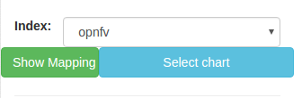
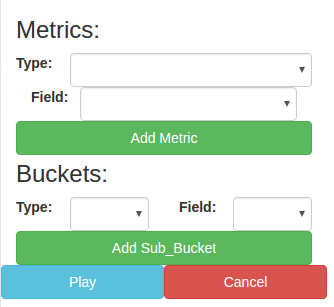
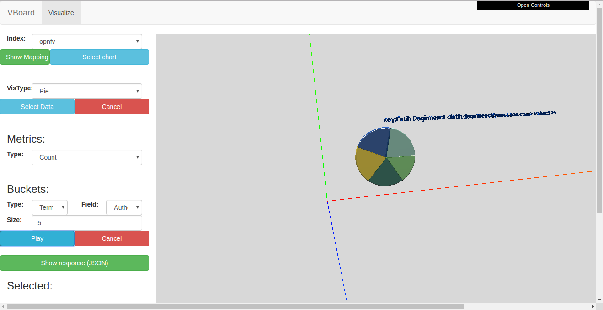
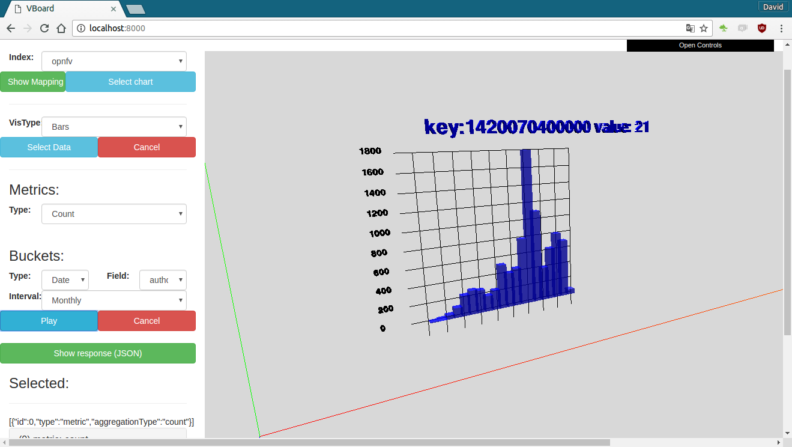
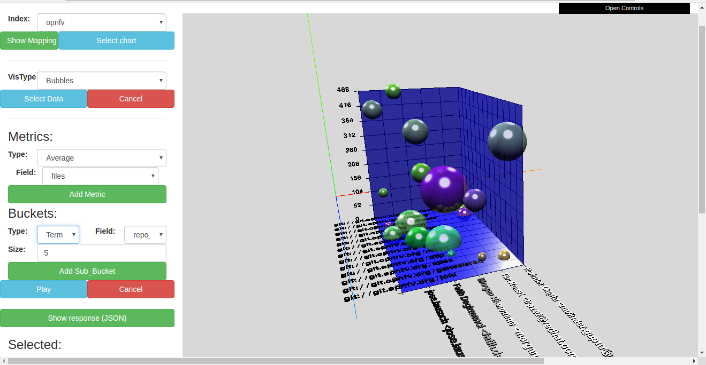
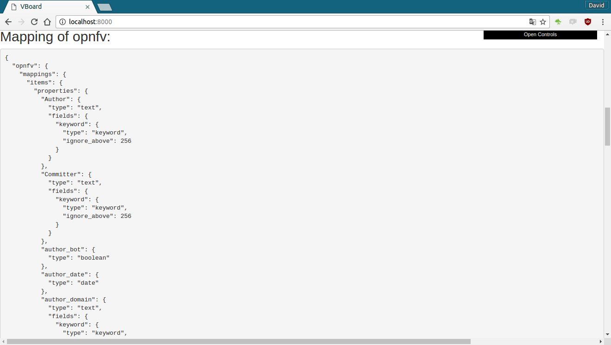
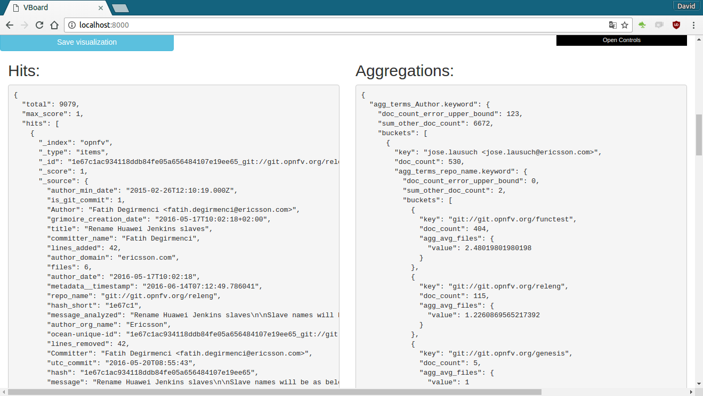

# Vboard (WP)
Platform to create (3D) charts of ElasticSearch data.

## Installation Steps

> **Important:** It is necessary to have installed and launched an  "**ElasticSearch 5.x in your localhost:9200**"
```
git clone https://github.com/dlumbrer/VBoard-UI
cd VBoard-UI
python -m SimpleHTTPServer
```

Go in your browser to http://localhost:8000/ and enjoy!


## Steps to build a a visualization

1. Select the index of your ElasticSearch (the index should have a type called "items")



2. Select Chart type
..* Pie, Bars, Line, Curve, 3DBars, Bubbles


3. Select Data (metrics and buckets)
..* Each chart require more or less metrics/buckets



4. Play!






## Others options

* **Show Mapping**: With this button you can see at the bottom of the page the mapping of the index.


* **Show Response (JSON)**: With this button you can see at the bottom of the page the response of ElasticSearch (Hits and Aggregations in JSON) of the data previously selected.


* **Save Visualization**: This button open a modal in order to save the visualization in ElasticSearch. The visualization will be saved in the index (**Previously created**) **.visthreed**. (See __Creation of the index .vissthreed__)


### Creation of the index .vissthreed

To save visualizations you must have created the index **.visthreed**, this is the mapping of the index (__Recommended use Sense or CURL to create it__):

```
PUT .visthreed
{
    "settings" : {
        "number_of_shards" : 1
    },
    "mappings" : {
        "items" : {
            "properties" : {
                "chartType" : { "type" : "text" },
                "name" : { "type" : "text" },
                "description" : { "type" : "text" },
                "visobject" : { "type": "object" }
            }
        }
    }
}
```

## Next Features

* Option to load visualizations previously saved
* Add **Dashboard** tab in order to build dashboards with multiple visualizations.
