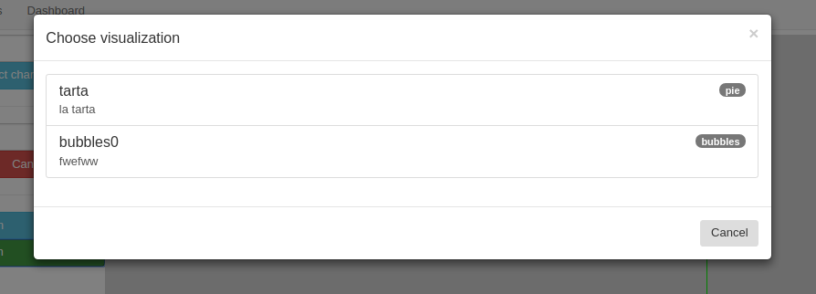
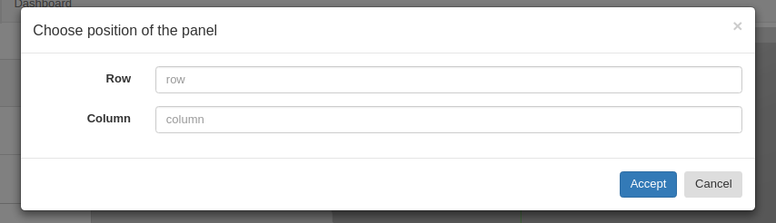
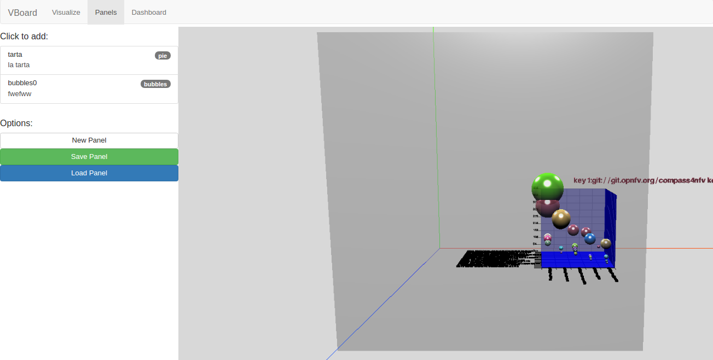
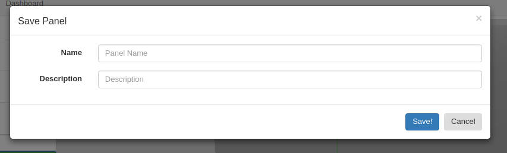
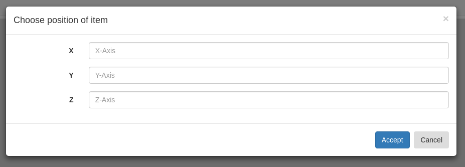
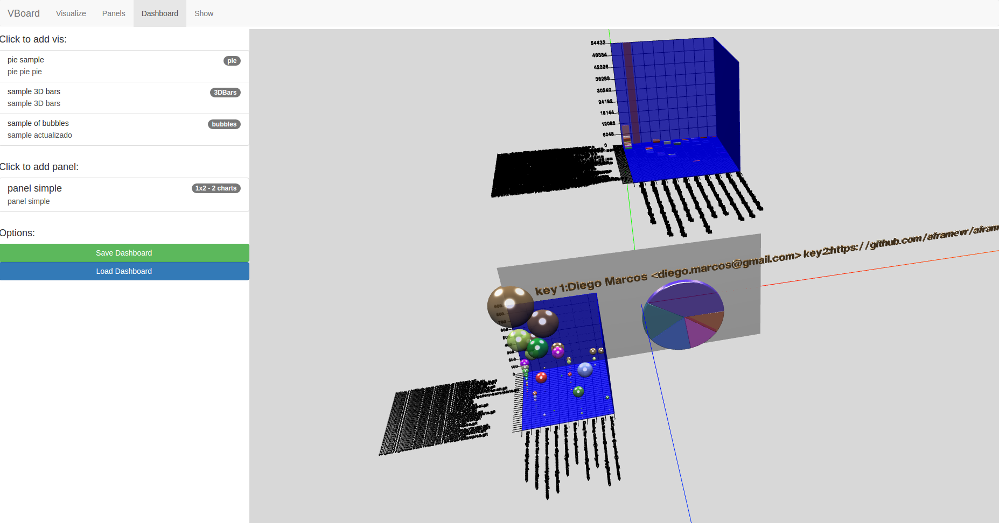
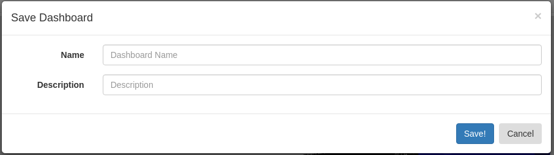
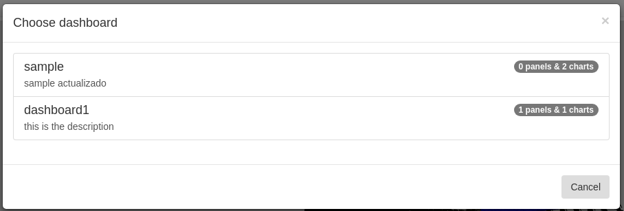
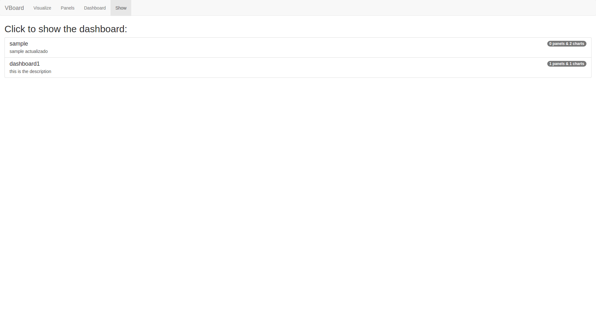
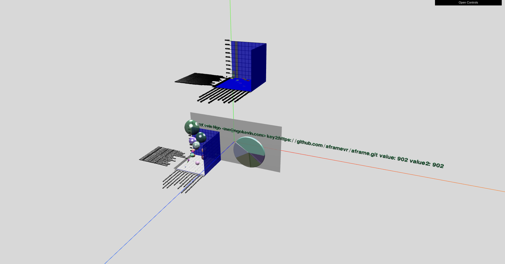

# Vboard (WP)
Platform to create (3D) charts of ElasticSearch data.

## Installation Steps

> **Important:** It is necessary to have installed and launched an  "**ElasticSearch 5.x in your localhost:9200**"

```
git clone https://github.com/dlumbrer/VBoard-UI
cd VBoard-UI
npm install
http-server (or a simple http server from python)
```

Go in your browser to http://localhost:8080/ and enjoy!


## Tab Visualize (to build a chart)

Follow this steps to build a a visualization:

* Select the index and the type of your ElasticSearch


* Select Chart type
  * Pie, Bars, Line, Curve, 3DBars, Bubbles


* Select Data (metrics and buckets)
  * Each chart require more or less metrics/buckets


* Play!


### Options

* **Show Mapping**: With this button you can see at the bottom of the page the mapping of the index.


* **Show Response (JSON)**: With this button you can see at the bottom of the page the response of ElasticSearch (Hits and Aggregations in JSON) of the data previously selected.


* **Save Visualization**: This button open a modal in order to save the visualization in ElasticSearch. The visualization will be saved in the index (**Previously created**) **.vboard**. (See __Creation of the index .vboard__)


* **Load Visualization**: This button open a modal in order to load a visualization.



## Tab Panels (to build a panels with charts)

First, you will see a default panel with 3 rows, 3 columns, [500,500] of dimension and 0.6 of opacity. Click on the list on the left to add a previously saved chart, you will se this modal:


After, you will see the chart selected in the panel:



### Options

* **New Panel**: Open a modal to build a new panel form scratch.


* **Save Panel**: Open a modal in order to save the Panel in ElasticSearch. The panel will be saved in the index (**Previously created**) **.vboard**. (See __Creation of the index .vboard__)


* **Load Panel**: Open a modal in order to load a Panel previously saved in ElasticSearch.


## Tab Dashboard (to build a dashboard with charts and panels)

First, you will see a default scene without charts/panels. Click on the list on the left to add a previously saved chart/panel, you will se this modal:


After, you will see the items selected in the dashboard:


### Options

* **Save Dashboard**: This button open a modal in order to save the dashboard in ElasticSearch. The visualization will be saved in the index (**Previously created**) **.vboard**. (See __Creation of the index .vboard__)


* **Load Dashboard**: This button open a modal in order to load a dashboard.



## Tab Show (to show a dashboard standalone)

First, select the dashboard you will want to see:


When you click, yo will go redirected to /Show/*id* where you will see the dashboard standalone


## Creation of the index .vboard

To save visualizations you must have created the index **.vboard**, this is the mapping of the index (__Recommended use Sense or CURL to create it__):

```
PUT .vboard
{
    "settings" : {
        "number_of_shards" : 1
    },
    "mappings" : {
        "visthreed" : {
            "properties" : {
                "chartType" : { "type" : "text" },
                "name" : { "type" : "text" },
                "description" : { "type" : "text" },
                "indexOfES" : {"type" : "text"},
                "typeOfES" : {"type": "text"},
                "metricsSelected" : { "type": "object" },
                "bucketsSelected" : { "type": "object" },
                "data" : { "type": "object" }
            }
        }
    }
}

PUT .vboard/_mapping/panelthreed
{
  "properties": {
    "position" : { "type" : "text" },
    "rows" : { "type" : "text" },
    "columns" : { "type" : "text" },
    "dimension" : { "type" : "text" },
    "opacity" : { "type" : "text" },
    "charts" : { "type" : "object" },
    "name" : { "type" : "text" },
    "description" : { "type" : "text" }
  }
}

PUT .vboard/_mapping/dashthreed
{
  "properties": {
    "background": { "type": "text"},
    "panels" : { "type" : "object" },
    "charts" : { "type" : "object" },
    "name" : { "type" : "text" },
    "description" : { "type" : "text" }
  }
}
```
