# User Guide of VBoard

This user guide explains step by step how to init VBoard, how to produce visualizations, how to save it, how to produce dashboards and how to save it and see it in the stand-alone version.  As the menu and the process is the same, we will explain the user guide for the A-FrameDC version, focusing in examples and how to take advantage of all functionality of VBoard. So we explain how to produce an entire dashboard with visualizations from scratch:

## Init VBoard

First of all, VBoard will check its connection to ElasticSearch, these are the steps that will be seen when entering the application:

1. First, VBoard will notify the user who is making configurations:
    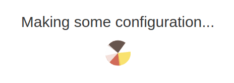
    When it cannot connect to ElasticSearch, this error message will appear:
    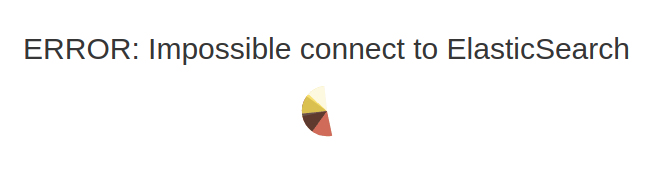
2. Once connected to ElasticSearch, it will search the index \textit{.vboard}, and then there are two options:
        The index doesn't exist, so it will try to create it, showing this information message:
        
    

    To do this, the mapping of the index will be uploaded. In the case that it could not upload the mapping for any reason, the following error message will be displayed:
    
    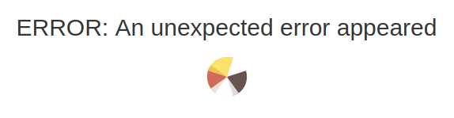
    
    If it has successfully uploaded the mapping, there will be a notification saying that everything is fine and it will enter VBoard:
    
    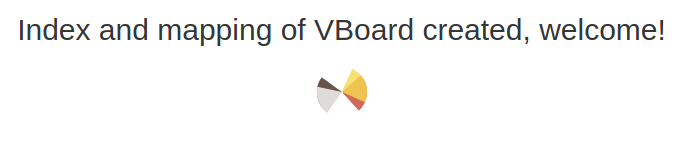
    
    The index is already created and therefore, everything is ready; this information message will appear:
    
    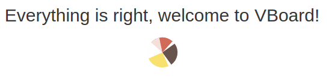

Finally, if everything is well loaded, VBoard will redirect you to the Visualize tab.

## Visualize

In order to build a 3D visualization, go to the tab "Visualize" and follow these steps:
1. Select the index and the type of your ElasticSearch where the data is going to be visualized, then click on "Select chart" button:

    

    Note that there are another button call "Show mapping", it is explained at the end of this section, in the Options section.
2. Select chart type: Pie, Bars, Smooth Curve, 3D Bars and Bubbles

    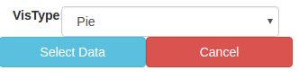

3. Select the aggregation data that you want to visualize. Note that each chart could require more or less aggregations (metrics/buckets).
    
    

4. Click on Play in order to see the visualization or Cancel if you want to go back. Later we will show two examples of visualizations

Moreover there are a few options apart from the build visualization process:

- Show mapping button, this button will show the mapping of the index selected, the mapping will be showed at the end of the page in a JSON format:

    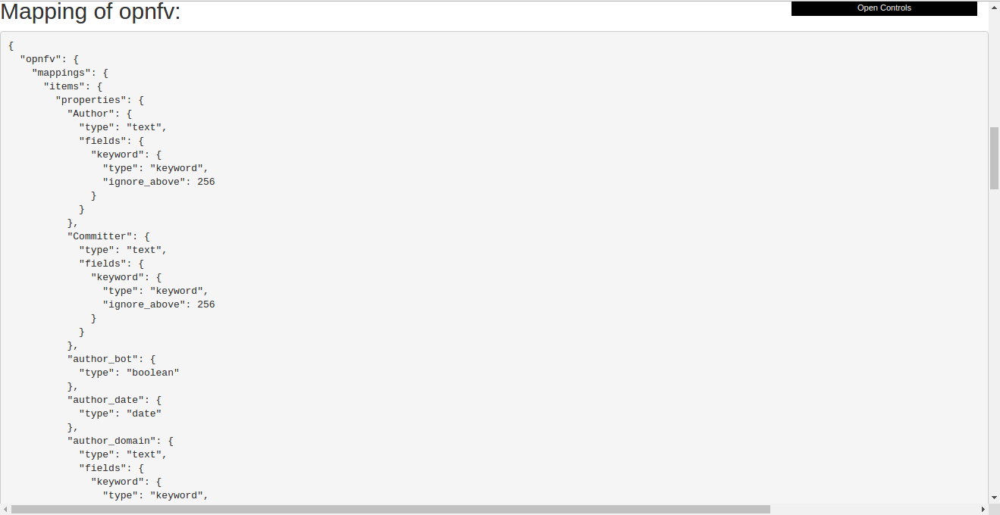

- Show Response (JSON), this button will show the result of the query of the aggregation selected before, in a JSON format at the end of the page. It will be two columns, one representing the data in raw and the other the aggregated data:
    
    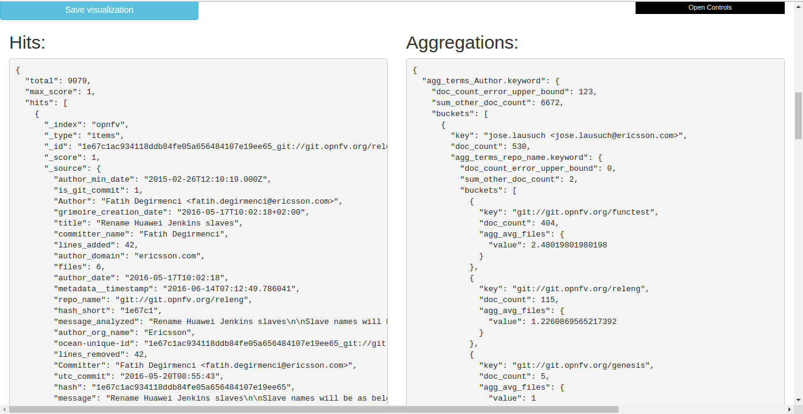

- Save visualization, this button will open a modal with a form in order to save the current visualization, the form contains a name and a description that will be saved with the visualization:

    

- Load visualization, this button will open a modal with a list of the saved visualization, each item is a button that will load the visualization in the current page. Each item shows the title, the description and the type of the saved visualization:

    

- Switch background, this button switches the current background in order to see the visualization in different environments, the background is just to show the aspect, it will not save it with the visualization.

Now, we are ready to build, save and load visualizations.

### Examples

To finish, these are two examples of visualizations that you can build with VBoard:

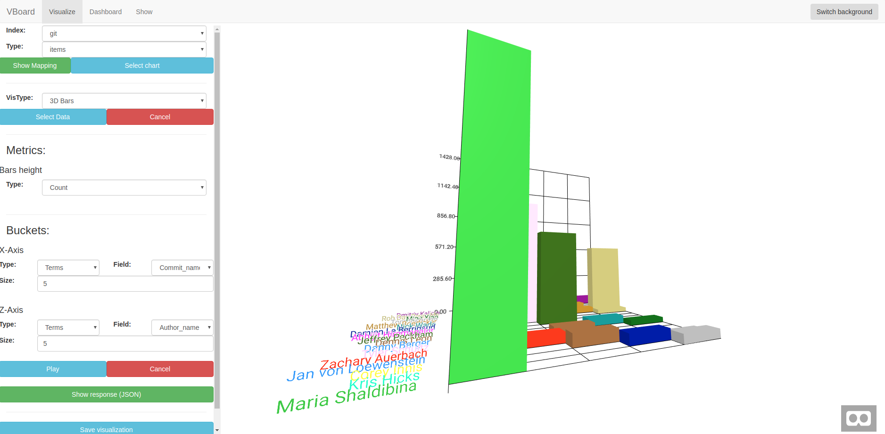
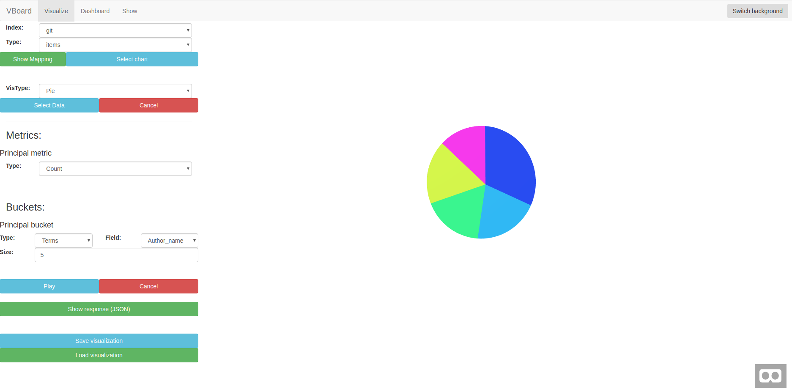

## Panels - Only in ThreeDC version 
In order to build a Panel, a flat plane with visualization, you have to have installed the ThreeDC version, then go to the Panels tab. By default, you will see a default panel with 3 rows, 3 columns, [500,500] of dimension and 0.6 of opacity. Then, let's fill the panel with visualization, you will see a list of the saved visualization on the left control menu:

1. Click on one of the available visualizations and a modal will appear in order to define in which row and column you want to put the visualization:

    

2. Once a visualization has been added to the panel, you will see the panel with the visualization:

    

Moreover there are a few options apart from the build panel process:

- New Panel button, this button opens a modal with a form in order to reset the panel and build a new one, you can define here the position of the panel, the rows/columns that it has, the dimension and the opacity.

    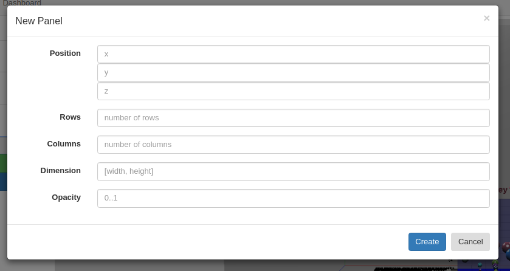

 - Save Panel, this button will open a modal with a form in order to save the current panel, the form contains a name and a description that will be saved with the panel:
    
    

- Load Panel, this button will open a modal with a list of the saved panels, each item is a button that will load the panel in the current page. Each item shows the title, the description and the visualization that the saved panel has:
    
    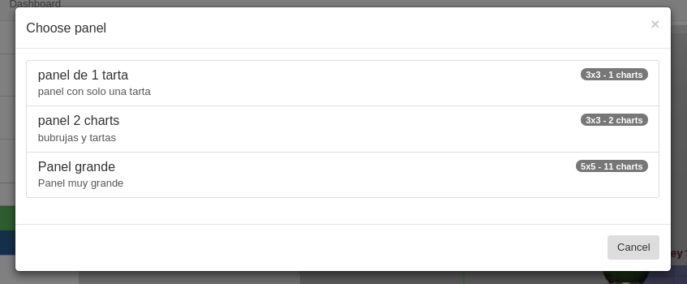

- Switch background, this button switches the current background in order to see the panel in different environments, the background is just to show the aspect, it will not save it with the panel.

### Example
To finish, this is an example of a panel that you can build with VBoard:

Now, we are ready to build, save and load visualizations.

## Dashboard
By default, you will see a default scene empty, in the control menu you will see a list of the saved visualizations (and panels if you are in the ThreeDC version):

1. Click on one of the available visualizations (or panels) and a modal will appear in order to define in which position and rotation you want to put the visualization:
    
    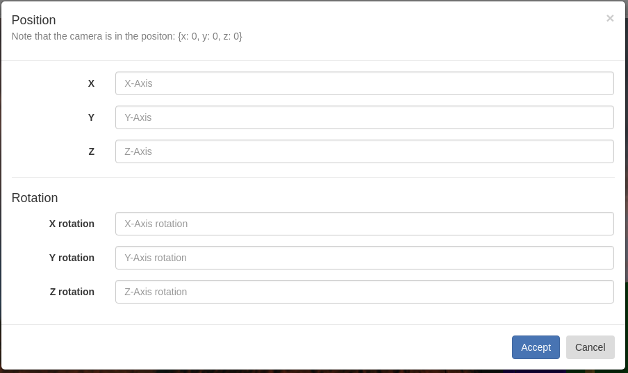

2. Once a visualization has been added to the panel, you will see the dashboard with the visualization:
    
    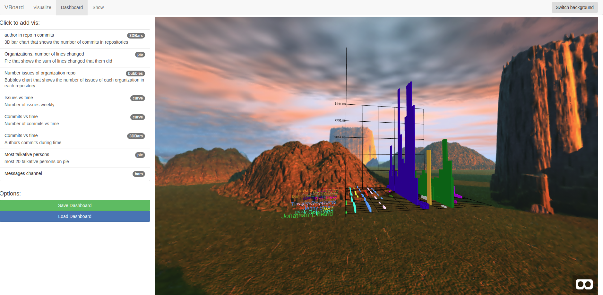

Moreover there are a few options apart from the build panel process:
- Save Dashboard, this button will open a modal with a form in order to save the current dashboard, the form contains a name and a description that will be saved with the panel:

    

- Load dashboard, this button will open a modal with a list of the saved dashboards, each item is a button that will load the dashboard in the current page. Each item shows the title, the description and the amount of visualizations that the dashboard has:

    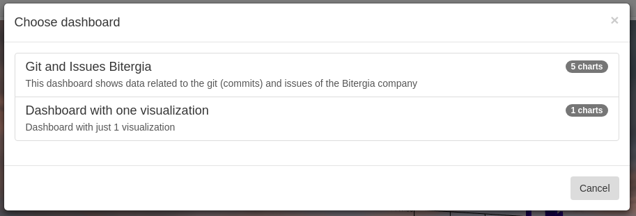

- Switch background, this button switches the current background in order to see the dashboard in different environments, the background will be saved with the dashboard, so in the next tab, Show, you will see the dashboard with the background.

### Example

This is a example of a dashboard created with VBoard, with different background and data:

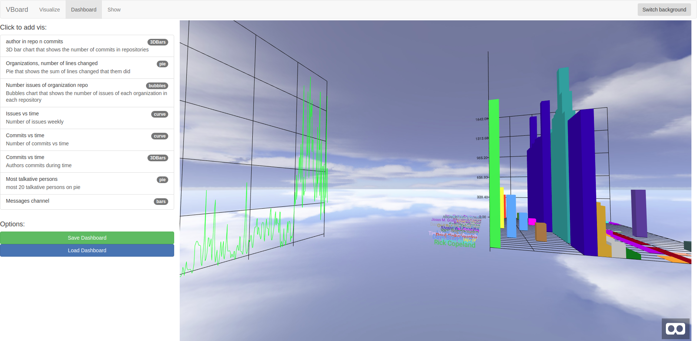

Finally, we have dashboards, so let's see them in the stand alone mode and in VR.

## Show

To finish, in order to see and analyze the dashboard in the "stand alone" mode, without the control menu, only to see the 3D scene, you have to go to the Show tab:

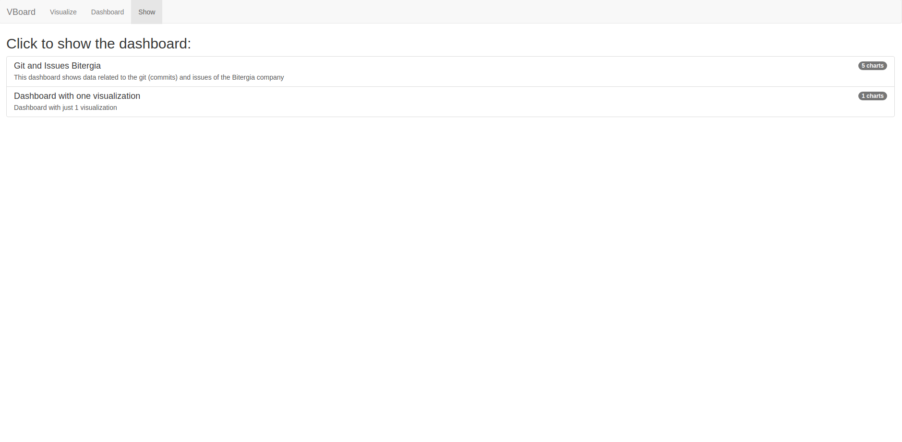

A list with the available saved dashboards is displayed; once clicked on them, the user will be redirected to the loaded dashboard in a specific url as follows: `http://vboard_url/#!/Show/name_dashboard`

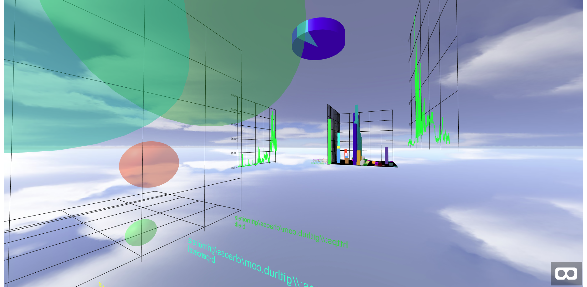}

As seen in the image, the dashboard is displayed in "stand alone" mode, without any menu in between except the button to enter VR. If we press the button we will automatically enter the VR mode, if we are using it in a browser on a computer, the change is hardly noticeable when entering VR, since by default what we observe is a full screen, if it is not a device that has VR.

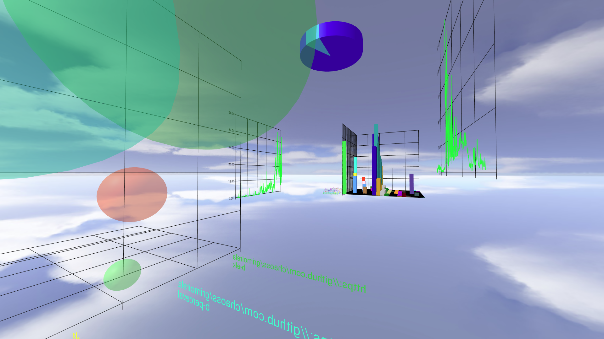

But instead, if we enter the url with a device that has integrated VR, for example, a smartphone, we can see how the 3D scene adapts to be used with VR glasses:

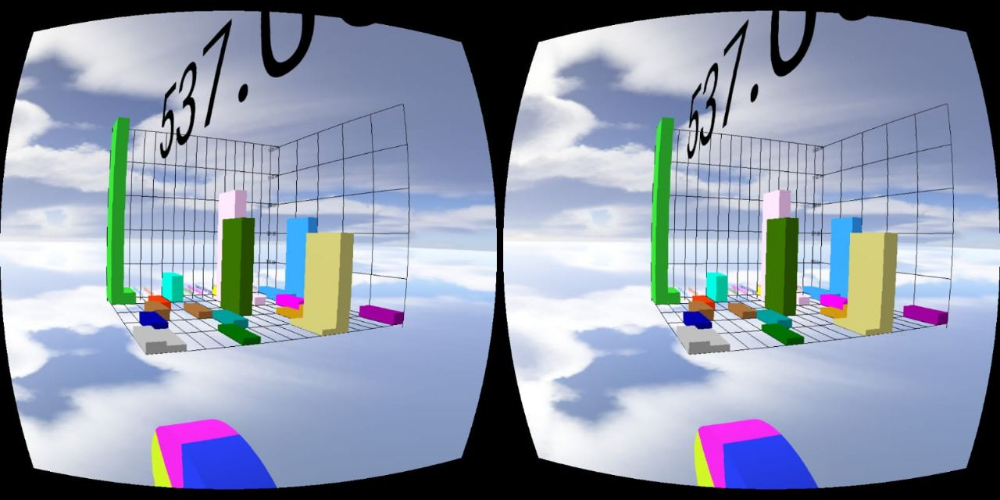

Also, entering straight forward to the url `http://vboard_url/#!/Show/name_dashboard` from any device guarantees to go directly to the dashboard in the "stand alone" mode without having to go through the other tabs.